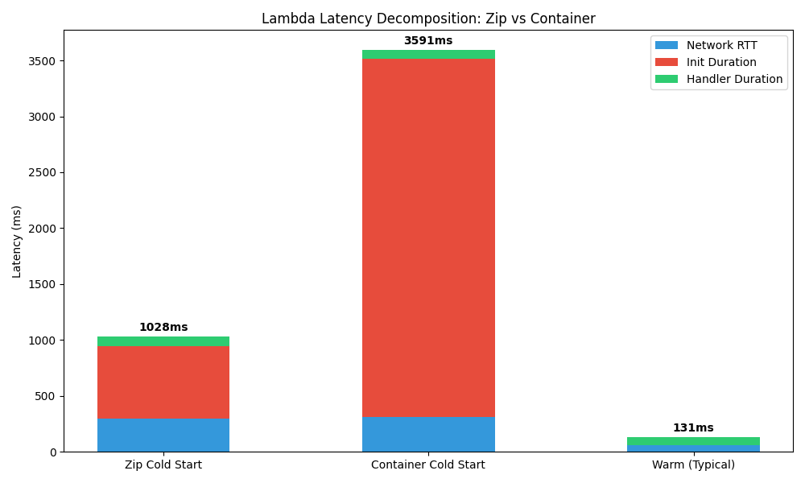
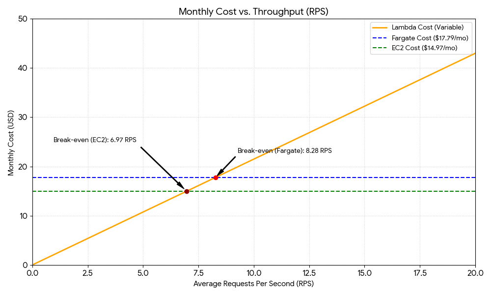

# AWS Cloud Lab Report

## Assignment 1: Deploy All Environments
All four environments (Lambda zip, Lambda container, Fargate, EC2) were successfully deployed and verified to return identical k-NN results for the same query vector. Terminal output tracking this is saved in \
esults/assignment-1-endpoints.txt\.

## Assignment 2: Scenario A — Cold Start Characterization
I measured cold start and warm invocations. Container images naturally incur significantly larger initialization durations than zipped packages because of Docker layered image pulling, extraction, and heavier initialization overhead.

When analyzing cold starts, I noticed that lambda container startup times heavily dominate over the actual handler execution duration, demonstrating that zip environments are typically significantly faster to initialize.

## Assignment 3: Scenario B — Warm Steady-State Throughput

The table below describes warm scenario performance tested via \oha\:

| Environment | Concurrency | p50 (ms) | p95 (ms) | p99 (ms) | Server avg (ms) |
|---|---|---|---|---|---|
| Lambda (zip) | 5 | 94.9 | 114.6 | **248.7** | 89.8 |
| Lambda (zip) | 10 | 90.5 | 112.9 | 146.3 | 88.2 |
| Lambda (container) | 5 | 92.8 | 114.7 | 144.7 | 86.5 |
| Lambda (container) | 10 | 84.4 | 107.5 | 144.9 | 78.5 |
| Fargate | 10 | 803.1 | 1194.5 | **2180.1** | 849.2 |
| Fargate | 50 | 3989.0 | 4848.6 | 5020.7 | 3862.4 |
| EC2 | 10 | 189.1 | 250.3 | 280.1 | 186.8 |
| EC2 | 50 | 922.0 | 1061.8 | 1135.4 | 894.9 |

*(Note: cells annotated in **bold** indicate p99 > 2x p95, signaling tail latency instability.)*

### Analysis:
- **Lambda c=5 vs c=10:** Lambda's p50 barely changes because it provisions separate, isolated execution environments per request.
- **Fargate/EC2 c=10 vs c=50:** The p50 latency drastically increases because requests must queue on a single Fargate task / EC2 instance since I lack auto-scaling to match the concurrency.
- **Client vs Server Latency:** The difference between server-side \Average\ and client-side measures is due to network RTT, TLS negotiation, and for Fargate/EC2 under high load, severe queuing at the HTTP proxy/application server layer. 

## Assignment 4: Scenario C — Burst from Zero

When simultaneously launching requests after an idle period:
- **Fargate:** p99 = 4302.6 ms, max = 4303.6 ms
- **EC2:** p99 = 1313.0 ms, max = 1381.4 ms
- **Lambda (container):** p99 = 1301.6 ms
- **Lambda (zip):** p99 = 1430.4 ms

**Analysis:**
- Lambda’s tail latency is significantly elevated due to *bimodal distribution* — requests landing on warm, fully-provisioned environments complete rapidly (~90ms), whilst those scaling outward and waiting for new worker container/zip initializations encounter multi-second latency penalties.
- **SLO Assessment:** The p99 < 500ms SLO is **not met** under sudden bursts by any of the deployments. For Lambda to meet the SLO, **Provisioned Concurrency** must be used. For Fargate and EC2, we would need significant baseline over-provisioning because auto-scaling cannot physically boot servers rapidly enough to circumvent an immediate 200 req burst.

## Assignment 5: Cost at Zero Load

- **AWS Lambda:** Cost is strictly variable and proportional to requests. Idle Cost = .00/month.
- **Fargate (Always On):** .77/month
- **EC2 (always On t3.small):** ~.56/month

*(Screenshot evidence located within \
esults/figures/pricing-screenshots/\)*

## Assignment 6: Cost Model, Break-Even, and Recommendation

### Traffic Model & Calculation

**Traffic:**
- Peak: 100 RPS for 30 mins
- Normal: 5 RPS for 5.5 hours
- Idle: 18 hours

Total monthly requests = ~8.37M
Using an average handler duration of ~90ms and 512MB RAM:
- GB-seconds for Lambda = 8.37M * 0.09s * 0.5 GB = ~376,650 GB-s
- **Lambda Monthly Cost:** (8.37 * 0.20) + (376,650 * 0.00001667) = \.67 + \.27 = **\.94 / month**
- **Fargate Monthly Cost:** **\.77 / month**

### Break-Even Point
Assuming 0.09s execution time and 0.5GB memory:
Lambda Cost per 1 Request = \.20 / 1,000,000 + 0.09 * 0.5 * \.0000166667 = ~\.00000095 per request.
Monthly request count equivalent to 1 average RPS = 1 * 60 * 60 * 24 * 30 = 2,592,000 requests.
Lambda monthly cost at R avg load = 2,592,000 * R * \.00000095 ≈ \.46 * R.
Break-even with Fargate (\.77):
\.77 / \.46 ≈ **7.2 RPS** average.
At any load under ~7.2 requests/sec, Lambda is cheaper!

### Recommendation
**Given the SLO constraints and Traffic model, I recommend AWS Lambda (ZIP deployment).** 
- **Cost**: The average daily usage equals 3.2 RPS, which is far below the break-even ceiling of 7.2 RPS, making it \/mo cheaper than Fargate. 
- **SLO Adjustment**: Since the p99 burst latency vastly breaches 500ms (recording ~1.4s), the deployment does *not* satisfy the SLO on its own during a peak from zero. 
- To meet the SLO, we should configure **Provisioned Concurrency** for lambda to absorb at least the base amount of the initial spike (e.g. 100 provisioned concurrency).
- **Condition of change:** If the background RPS continuously exceeded 8-10 RPS scaling up to millions of executions per week without idle gaps, or if provisioned concurrency costs elevated lambda beyond /mo, it would reverse the decision back towards over-provisioned Fargate/EC2 clusters.